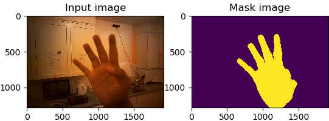

# Hand-Segmentation

This work was done for a practice purpose.
https://github.com/wudonghao/Hand-Segmentation.git

</img>

# Pytorch-UNet

Customized implementation of the [U-Net](https://arxiv.org/pdf/1505.04597.pdf) in Pytorch. This was used with only one output class.
The model used for the last submission is stored in the `MODEL.pth` file.
It was pretrained with a modle available on the [Kaggle website](https://www.kaggle.com/c/carvana-image-masking-challenge/data),  yet which is originally for car segmentation.
The modle is scored a [dice coefficient](https://en.wikipedia.org/wiki/S%C3%B8rensen%E2%80%93Dice_coefficient) of 0.90 on a part of images from GTEA_gaze dataset.

pytorch version: 0.3.1

To roll back your pytorch, you can run only with

"pip uninstall torch"

"pip install torch==0.3.1"

## Usage
### Test

" python test.py -i test1.jpg -o ouput1.jpg "

" python test.py -i test1.jpg test2.jpg --model MODEL.pth "

" python test.py -i test1.jpg --viz "

### Training

You can use " python train.py -h " to see more options

Simply train by running 

"python train.py"

Train with GPU model

"python train.py -g"

Default value of val_train percentage equals to 0.05

### Evaluation

Unzip "result.tar.gz" to get all the saved results file.

Evaluate them using dice coefficient by running
"python eval_all.py -b 2 -l 0.02 -c MODEL.pth -g"

### Dataset
Run "bash download_data.sh" to get the dataset. (over 700M)

## Warning

1.Notice that dirs in this work are absolute path. Please change it for your usage. 

2.In order to process the image, it is split into two squares (a left on and a right one), and each square is passed into the net. The two square masks are then merged again to produce the final image. As a consequence, the height of the image must be strictly superior than half the width. Make sure the width is even too. Images for training in this work are avaliable with a size of 1918 * 1280. Please resize your own data or optimize this project to your convenience.

3.Batch_size over 4 causes overflow on my machine probably for the above reason.

4.The ground truth images as input have been binarized with 0 and 1 in advance. 

5.Some codes for image processing are provided in the file named "Image_processing_tools" while without any guarantees for directly using.

## Dependencies
This package depends on [pydensecrf](https://github.com/lucasb-eyer/pydensecrf), available via `pip install`.

